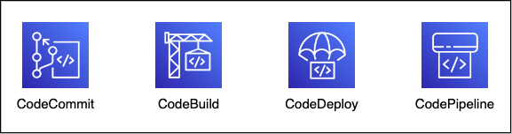

# terraform-custom-patterns

## Author: Tin Trung Ngo

This repository is meant for custom deployment patterns using Terraform

## Pattern 1: OpenTelemetry Collector on ECS

For Amazon ECS, Normally it is recommended to use AWS Distro for OpenTelemetry (ADOT) collector for container instrumentation. This pattern use the official open-source OpenTelemetry Collector image to build an ECS service.

## Pattern 2: CI/CD with AWS Developer Tools

A bunch of CI/CD use cases that leverage AWS Native Developer Tools

