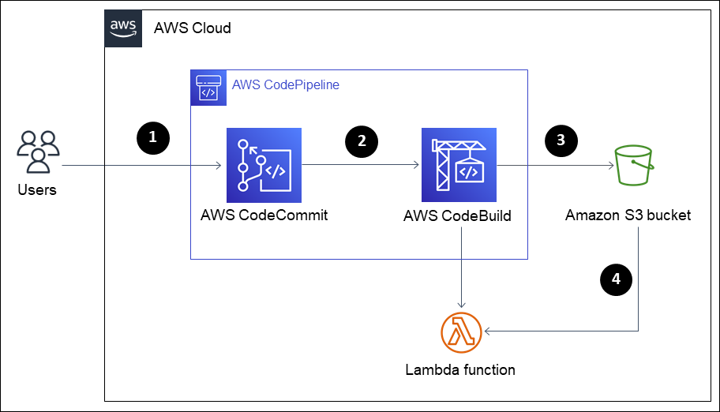

# Automated Lambda function update

Updating Lambda functions deployed using source code .`zip` files stored in Amazon S3 bucket required re-compressing and re-uploading those `.zip` file every time there’s changes. That manual process is error-prone and requires a lot of time and effort.

&nbsp;

AWS **CodePipeline** can help building an automated pipeline that simplify the update process of Lambda code and doesn’t require manual updates.

The concept is Developers update the code directly in **CodeCommit** and merge the changes to the mainline branch. The pipeline will then automatically updates the Lambda code to reflect the latest change without requiring manual actions of coping, compressing, and uploading .zip files to Amazon S3.

&nbsp;

The prerequisites for this solution are:

1.  All Lambda functions are deployed using package from S3
2.  A CodeCommit repository that contains `source code` for the functions.
3.  A CodeBuild project to build new version on CodeCommit merge and update Lambda function with latest code.

&nbsp;

The architecture and procedures can be demonstrated as bellow:



1.  Users merge code in CodeCommit source repository.
2.  The pipeline detect changes on application source code and trigger build stage.
3.  CodeBuild starts building new package version and stored in S3
4.  CodeBuild triggers update Lambda function to reflect newest package version.

&nbsp;

Sample buildspec.yaml file for CodeBuild can look like bellow example. This file is placed within the CodeCommit repository in this solution.

```yaml
version: 0.2
phases:
  pre_build:
    commands:
      - echo "Pre build, checking current directory..."
      - ls
      - echo "Installing required dependencies..."
      - pip install --upgrade pip
      - pip install -r requirements.txt -t ./package
  build:
    commands:
      - echo Build started on `date`
      - cp -r ./lambda_function/* ./package/
      - cd package
      - zip -r ../lambda_function.zip .
      - aws s3 cp ../lambda_function.zip s3://$BUCKET_NAME/lambda/lambda_function.zip
      - wait
      - aws lambda update-function-code --function-name $LAMBDA_FUNC_NAME --s3-bucket $BUCKET_NAME --s3-key lambda/lambda_function.zip
  post_build:
    commands:
      - echo Build post_build on `date`
      - echo ${LAMBDA_FUNC_NAME}
      - echo ${BUCKET_NAME}
```

&nbsp;

Refer to [Automating AWS Lambda code updates with CodePipeline](https://aws.amazon.com/blogs/infrastructure-and-automation/save-time-reduce-errors-automating-lambda-code-updates/) article, a technical blog on how to auto-update Lambda function on code changes, as a reference.

&nbsp;
